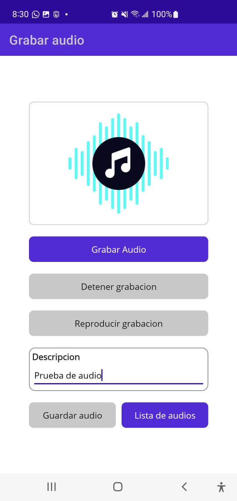
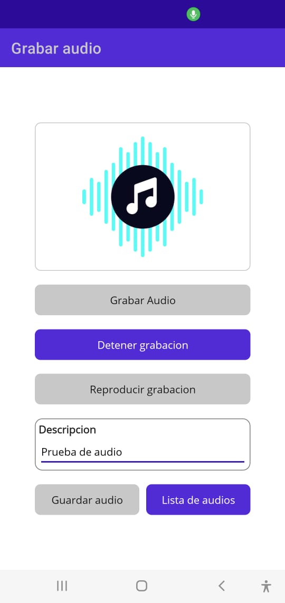
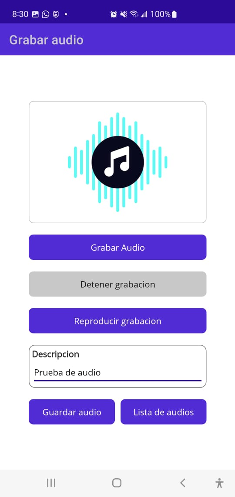
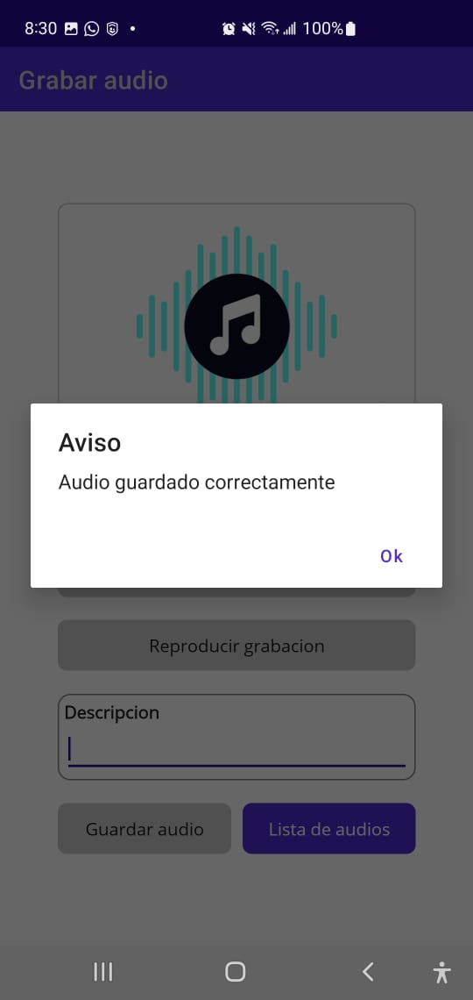
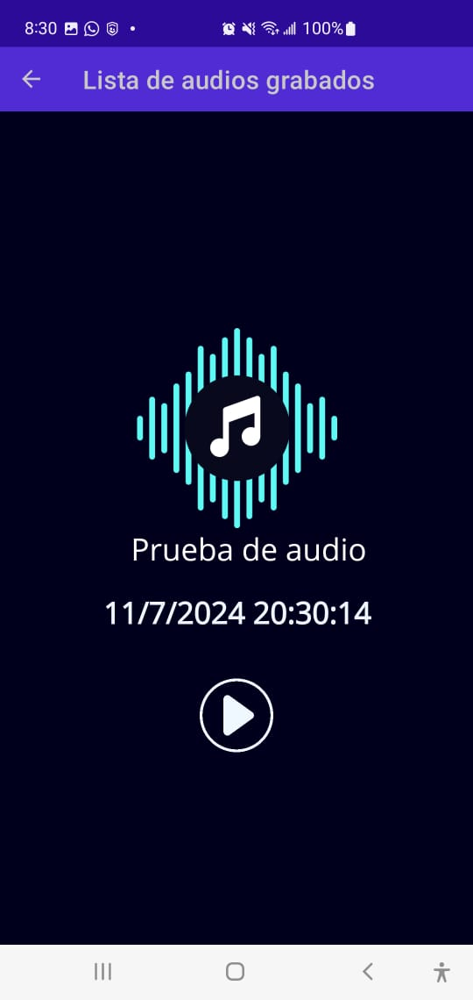

# Programacion Movil 2 -PM2Tarea2.3Grupo1📱

 

  

<h3 align="center">App - PM2T2.3Grupo1</h3>

  

    Prog. Movil 2/Tarea 2.3 - App Grabar audio en Net MAUI
     
     
  

## Funciones 📱

- [x] Gradar Audio
- [x] Detener grabacion
- [x] Reproducir grabacion
- [x] Agregar Titulo (Descripcion del audio)
- [x] Ver lista de audio grabado en modo Slider
         

## Screenshots

<table>
  	<tr>
	<td align="center"></td>
	<td align="center"></td>
	<td align="center"></td>
	</tr>
 	<tr>
	<td align="center"></td>
	<td align="center"></td>	
	</tr>
</td>
	  

</table>

## Autores ✒️

Gracias a estas maravillosas personas ✅ :

<table>
  <tr>
    <td align="center"><a href="https://github.com/yefrinp"> <b>Yefrin Pacheco</b></a> <a href="https://github.com/yefrinp" title="Code">💻</a></td>		
    <td align="center"><a href="https://github.com/ATrejo98"> <b>Juan Angel Trejo</b></a> <a href="https://github.com/ATrejo98" title="Code">💻</a></td>
    
</table>

## License

- **[MIT license](http://opensource.org/licenses/mit-license.php)**
- Copyright 2024 © <a href="#" >UTH Team</a>.

